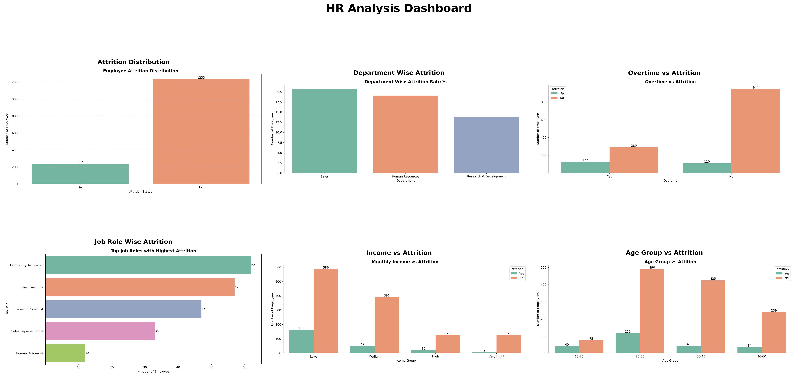
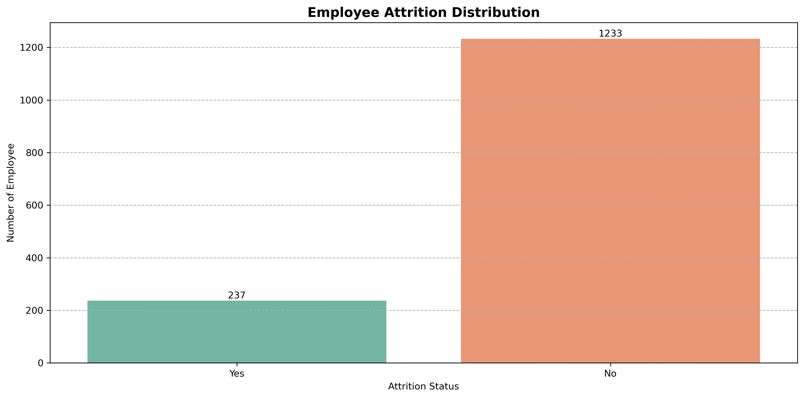
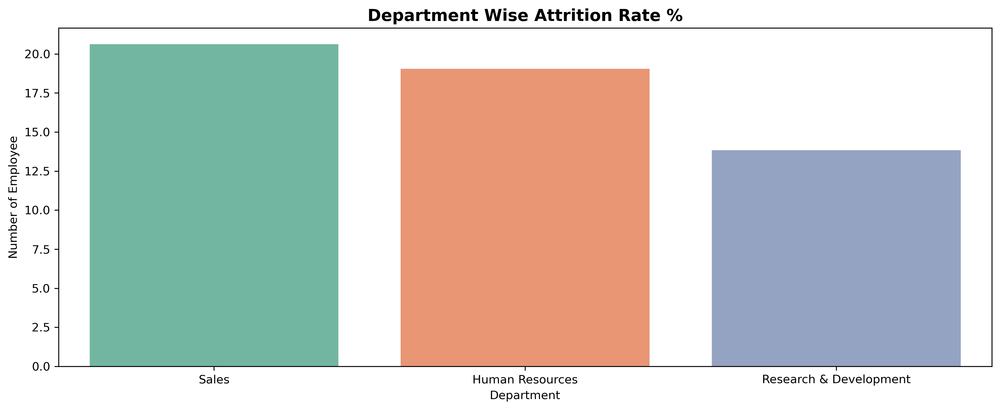
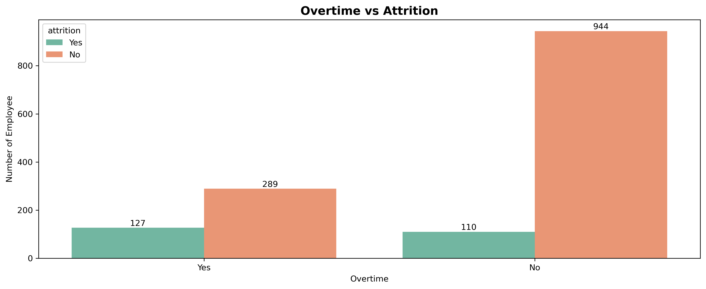
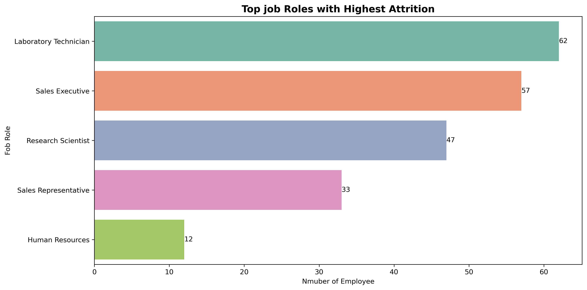
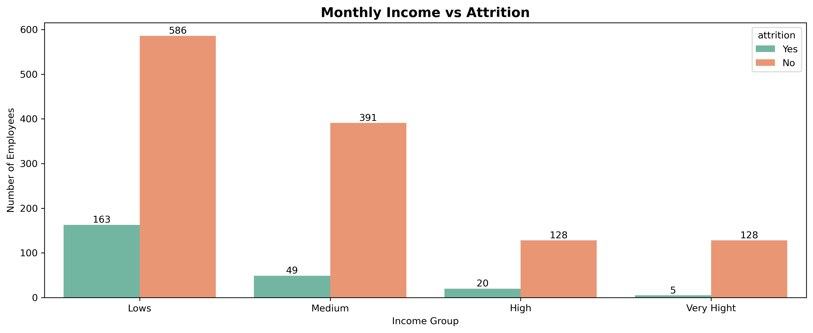
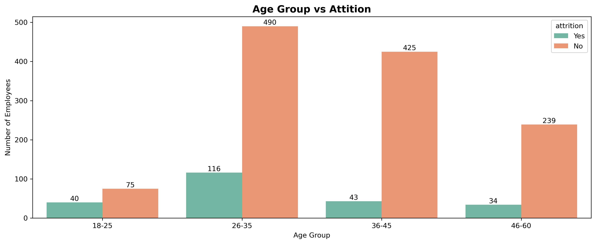

# HR Analytics Dashboard 📊

## Project Overview
This project analysis employee attrition and identifies the key factors affecting employee turnover.

---

## Dashboard Preview

---

## Key Insight

- Sales department has the highest attrition rate.
- Employees working overtime are more likely to leave.
- Low income employees show higher turnover.
- Employees aged 26-35 have the highest attrition.

---

## Visual Analysis

### 1. Emloyee Attrition Distribution

**Business Insight**

- Most employees stay with the company.
- However, attrition still impacts workforce stability.

**Key Finding**
- Around 16% of employees left the organization.

---

### 2. Department Wise Attrition

**Business Insight**
- Sales department shows the highest attrition rate.
- HR should focus retention efforts in Sales teams.

---

### 3. Overtime vs Attrition

**Business Insight**
- Employees working overtime leave more frequently.
- Work-life balance may influence retention.

---

### 4. Job Role Wise Attrition

**Business Insight**
- Certain job roles experience higher turnover.
- Targeted retention programs can reduce attrition.

---

### 5. Monthly Income vs Attrition

**Business Insight**
- Lower-income employees have higher attrition.
- Compensation plays an important role in retention.

---

### 6. Age Group vs Attrition

**Business Insight**
- Employees aged 26–35 show the highest turnover.
- Early-career employees need stronger engagement strategies.

---

## Tools Used

- Python
- Pandas
- NumPy
- Matplotlib
- Seaborn
- Jupyter Notebook

---

## Final Conclusion

Employee attrition is strongly influenced by department, overtime, income level, age group, and job role. These insights can help HR teams improve employee retention and workforce planning.